# SkillSync: Athlete Rating and Performance Tracking

## Table of Contents

- [SkillSync: Athlete Rating and Performance Tracking](#alpine-performance-analytics-athlete-rating-and-performance-tracking)
  - [Table of Contents](#table-of-contents)
  - [Core Components of Athlete Evaluation](#core-components-of-athlete-evaluation)
    - [1. Skills and Exercises](#1-skills-and-exercises)
    - [2. Scoring Criteria](#2-scoring-criteria)
    - [Scoring Criteria Demo](#scoring-criteria-demo)
    - [3. Performance Recording](#3-performance-recording)
  - [Athlete Rating Process](#athlete-rating-process)
    - [1. Data Collection and Bulk Import](#1-data-collection-and-bulk-import)
    - [2. Score Calculation](#2-score-calculation)
    - [3. Skill Rating Aggregation And Visualization](#3-skill-rating-aggregation-and-visualization)
  - [Analysis and Reporting](#analysis-and-reporting)
    - [1. Individual Athlete Profiles](#1-individual-athlete-profiles)
    - [2. Performance Tracking](#2-performance-tracking)
    - [3. Athlete Comparisons](#3-athlete-comparisons)
    - [4. Leaderboards](#4-leaderboards)
      - [Leaderboard Demo](#leaderboard-demo)
    - [5. Comprehensive Reports](#5-comprehensive-reports)
  - [Additional Features](#additional-features)
    - [1. Group Management](#1-group-management)
    - [2. Measurement Tracking](#2-measurement-tracking)
    - [3. Comments and Notes](#3-comments-and-notes)
    - [4. Quick Search](#4-quick-search)
    - [5. Athlete List Management](#5-athlete-list-management)
    - [6. Batch PDF Generation](#6-batch-pdf-generation)
  - [Additional Video Demonstrations](#additional-video-demonstrations)
    - [Athlete Page Demo](#athlete-page-demo)
    - [Scoring Criteria Demo](#scoring-criteria-demo-1)
  - [Conclusion](#conclusion)

SkillSync is a web application designed for coaches to track, analyze, and improve athlete performance through a rating system. This presentation explains how athletes are rated, scored, and evaluated within the system.

## Core Components of Athlete Evaluation

### 1. Skills and Exercises

Skills are fundamental abilities crucial for athletic success. These are measured through specific exercises designed to assess an athlete's competency in various areas.

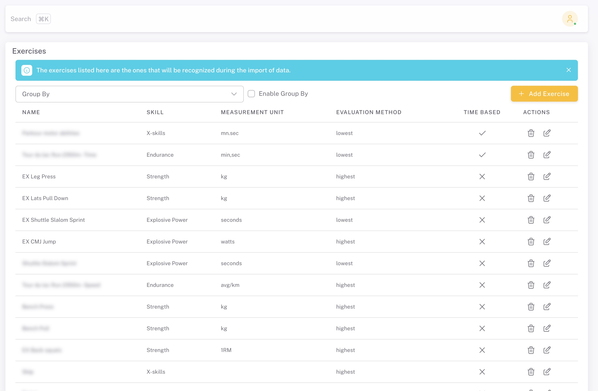

- This screenshot shows the exercise management interface
- Coaches can configure different exercises and tests
- Each exercise is linked to specific skills it measures

  
ℹ️ Click for more details

- Coaches can set up and manage various tests and exercises
- The interface allows for fine-tuned control over each exercise
- Supports both time-based and score-based exercises
- Exercises can be categorized and organized for easy access and management
- Custom exercises can be created to meet specific training program needs

### 2. Scoring Criteria

Scoring criteria define how performances in exercises are evaluated. These are customizable based on groups (e.g., age categories) and genders.

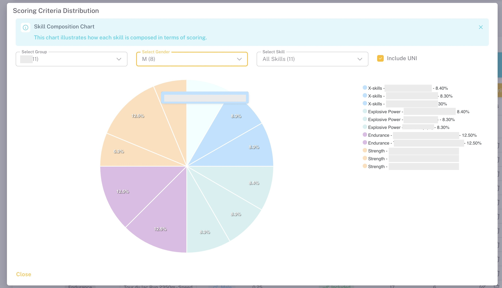

- The image displays scoring criteria visualization
- Different criteria can be established for various groups and genders
- This ensures fair and accurate performance evaluation across diverse athlete populations

### Scoring Criteria Demo
[📽️ Watch Demo](video/scoring_criteria_demo.mp4)

This video explains the process of setting up and adjusting scoring criteria, showing how the system can be customized for different groups and performance metrics.

  
ℹ️ Click for more details

- Fully customizable to account for group and gender
- Allows for the creation of multiple scoring scales for each exercise
- Coaches can set minimum and maximum scores, as well as intermediate benchmarks
- The scoring distribution visualization helps in understanding the notation spread across athletes

### 3. Performance Recording

Athletes' performances in various exercises are recorded and evaluated against the established scoring criteria.

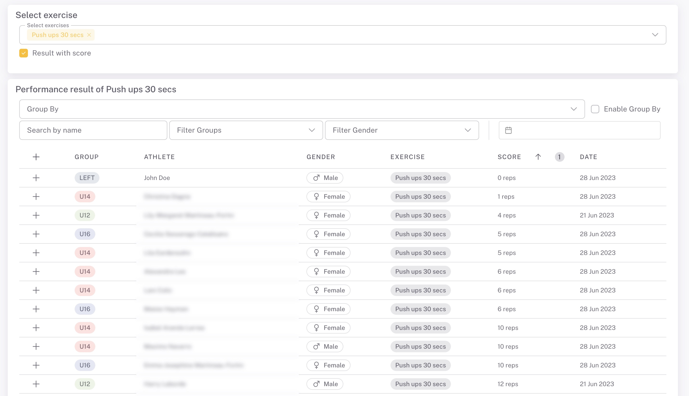

- This comprehensive interface provides tools for managing performance data
- Coaches can freely select, filter, and sort raw performance data (without scores)
- Editing and deleting individual performance entries is supported for data accuracy
- The system offers advanced graphing capabilities:
  - Compare exercises of the same type across multiple athletes
  - Visualize different exercises on the same graph to identify correlations
  - Track performance evolution over time for individuals or groups
- Coaches can create logical analyses by examining relationships between different exercises and their progression
- This flexible approach allows for deep insights into athlete development and the effectiveness of training programs

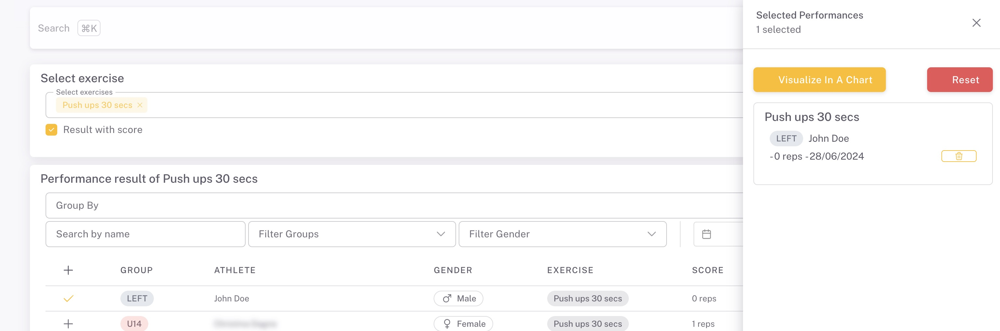

  
ℹ️ Click for more details

- Advanced filtering options allow focus on specific time periods, athletes, or exercise types
- Historical data is easily accessible, allowing for long-term trend analysis

## Athlete Rating Process

### 1. Data Collection and Bulk Import

Performance data is collected across multiple exercises and over time, with a bulk import feature for efficiency.

[Watch Data Import Demo](video/demo_import.mp4)

- The system supports bulk data import using tailored Excel template files
- This feature allows coaches to efficiently input large amounts of data in batches
- Import templates are available for various data types:
  - Athlete List: Add athlete information
  - Performance Data: Input results from multiple exercises and tests
  - Email Lists: Add or Update contact information for athletes and parents
  - Comments: Add notes or observations for multiple athletes
  - Height and Weight Measurements: Update physical data for tracking growth and fitness

  
ℹ️ Click for more details

- The use of Excel templates offers significant advantages:
  - Coaches can use a familiar application they already know well
  - No need to learn a new interface for data entry, reducing training time and user resistance
  - Leverages the full power and flexibility of Excel for data handling
  - Allows for quick data entry in the field using laptops or tablets
  - Coaches can work offline and upload data when connected

- The import process is streamlined and user-friendly:
  1. Coaches fill out the appropriate Excel template with new data
  2. The completed template is uploaded to the system
  3. Data is automatically processed and integrated into the database
  4. The system applies appropriate scoring criteria and updates athlete profiles

- This bulk import capability offers numerous benefits:
  - Significantly reduces data entry time and minimizes errors
  - Allows coaches to quickly update the system after training sessions or competitions
  - Provides flexibility for different data collection scenarios (e.g., on-field, during travel)
  - Enables efficient collaboration among multiple coaches or staff members

By leveraging these powerful data collection and import tools, coaches can maintain up-to-date and comprehensive athlete records with minimal effort and maximum flexibility. This approach respects coaches' existing workflows and expertise with Excel, ensuring a smooth integration of the performance analytics system into their daily routines. The result is more time for analysis and athlete development, with less time spent on data entry and system learning.

### 2. Score Calculation

Raw performance data is converted into standardized scores based on the scoring criteria.

- The system converts raw scores into standardized notes (typically 0-100)
- Factors considered include:
  - The athlete's raw score
  - Scoring criteria for the specific exercise, group, and gender
  - Evaluation method (highest or lowest score is best)
- Scoring coefficients are applied to weight the importance of each exercise
- Time-based exercises are converted to a standardized format for consistent evaluation

### 3. Skill Rating Aggregation And Visualization

Scores from related exercises are aggregated to produce overall skill ratings for each athlete.

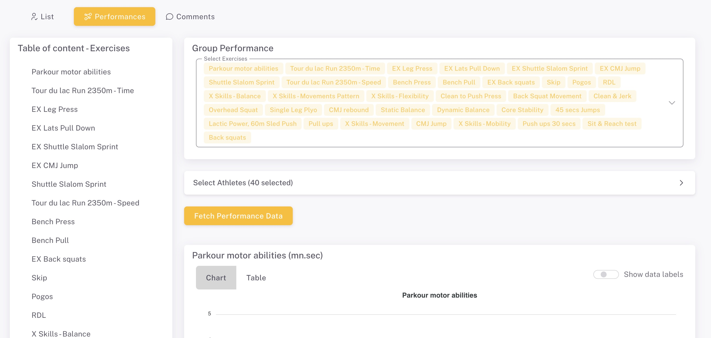

- This screen displays the selection of exercises to set athlete performance of a same group on different graphs
- It allows coaches to compare performances across multiple athletes in the same group
- Helps in identifying trends and patterns within the group

## Analysis and Reporting

### 1. Individual Athlete Profiles

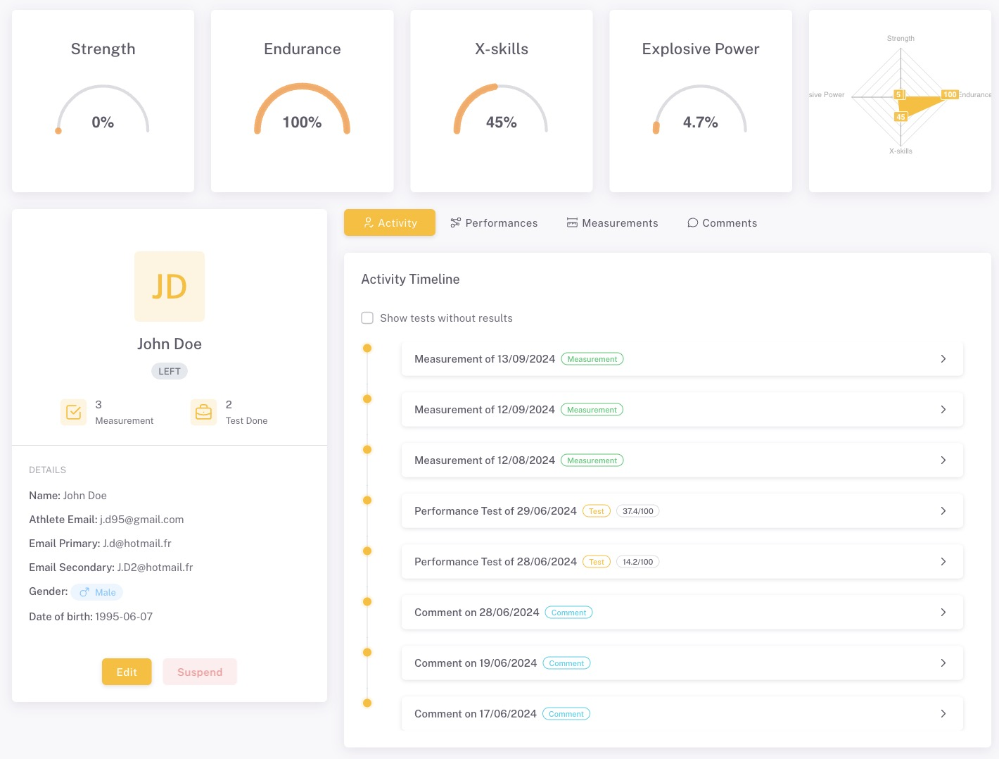

- Detailed athlete profiles display comprehensive performance data
- Coaches can quickly assess an athlete's overall progress and specific skill levels
- This view provides a holistic overview of an individual athlete's performance across various metrics

### 2. Performance Tracking

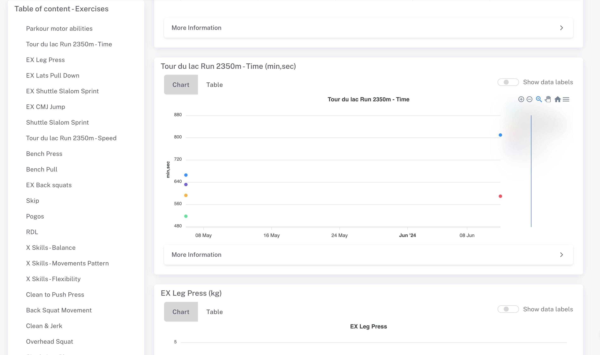

- Interactive graphs allow for visual tracking of progress over time
- Trends and improvements can be easily identified

### 3. Athlete Comparisons

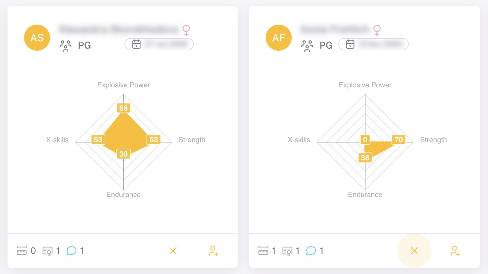

- Direct comparisons help identify relative strengths and weaknesses among team members
- Coaches can use this information for targeted training strategy

### 4. Leaderboards

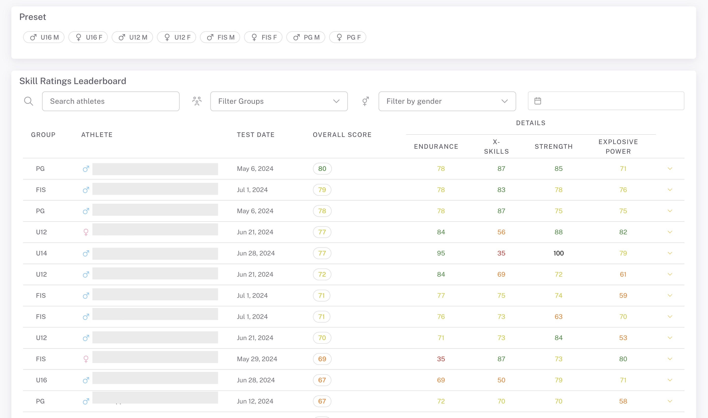

#### Leaderboard Demo

[📽️ Watch Demo](video/leaderboard_demo.mp4)

This demo presents the leaderboard functionality, demonstrating how coaches can compare athlete performances across various tests and metrics. The leaderboard feature provides a quick overview of top performers in different categories, helping coaches identify standout athletes and areas where others may need improvement.

- They allow coaches to compare notation of test
- Useful for identifying top performers and areas needing improvement across the athletes

### 5. Comprehensive Reports

The system generates detailed, custom reports for in-depth analysis of athlete performance.

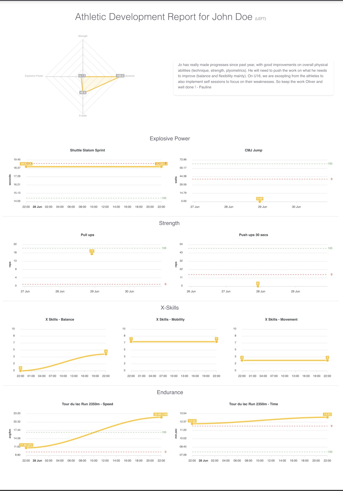
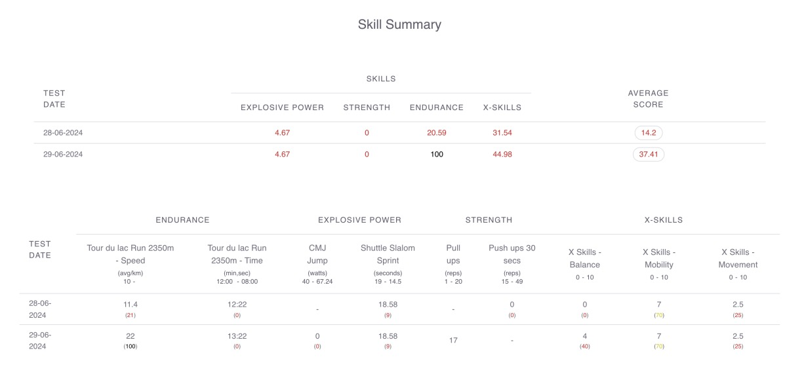

- Reports are tailored for each group, providing relevant and focused information
- Each report consists of several sections:
  - Skill breakdowns with associated exercises
  - Performance graphs for visual representation of progress
  - The most recent coach's comment for context
  - A radar chart displaying skills notation, offering a quick overview of an athlete's strengths and areas for improvement
- These comprehensive reports allow coaches to:
  - Track progress over time
  - Identify patterns in performance
  - Communicate effectively with athletes and parents about development

After creation, reports can be converted to PDF format for easy distribution and archiving.

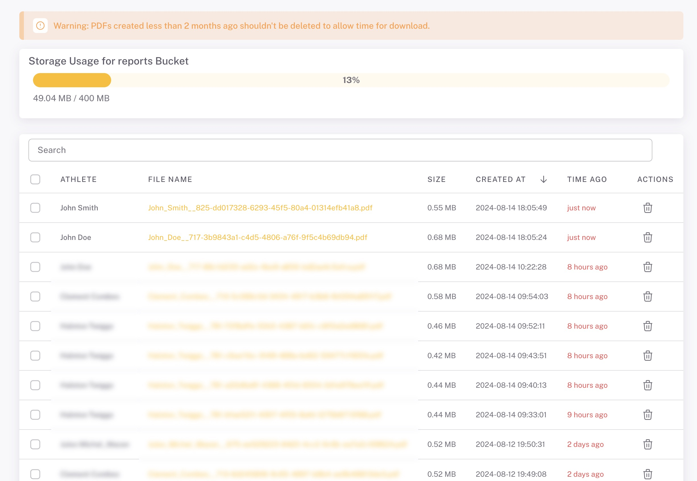

- This screen shows the management interface for previously created PDFs
- Coaches can:
  - Retrieve old reports for reference or comparison
  - Delete outdated PDFs to manage storage efficiently
  - Organize reports by athlete, group, or date
- The storage system ensures that historical data is easily accessible while allowing for proper data management
- Each athlete can have up to 3 contacts (typically the athlete and parents) for report distribution, ensuring that all relevant parties stay informed about the athlete's progress

## Additional Features

### 1. Group Management

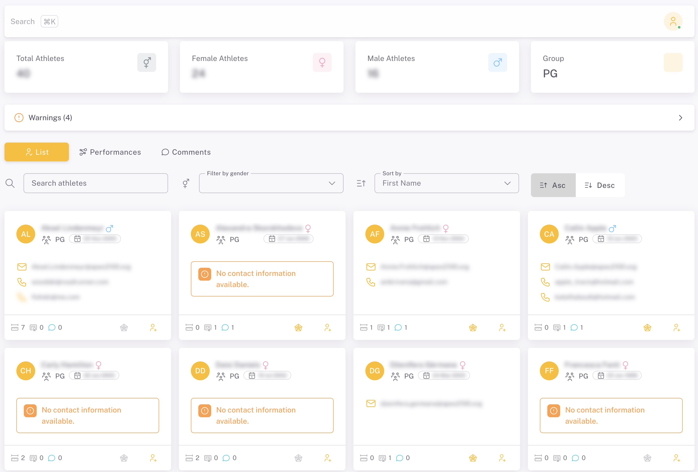

- Group-specific statistics and performance data can be viewed
- Simplifies management and analysis of athletes in similar categories
- Athlete data flagging.

### 2. Measurement Tracking

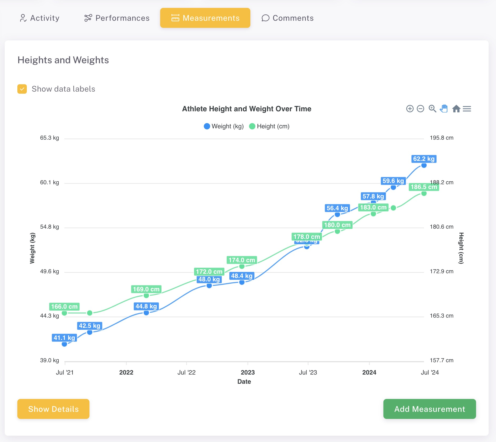

- Physical measurements can be recorded and monitored
- This allows for tracking changes in height, weight, and other relevant metrics

### 3. Comments and Notes

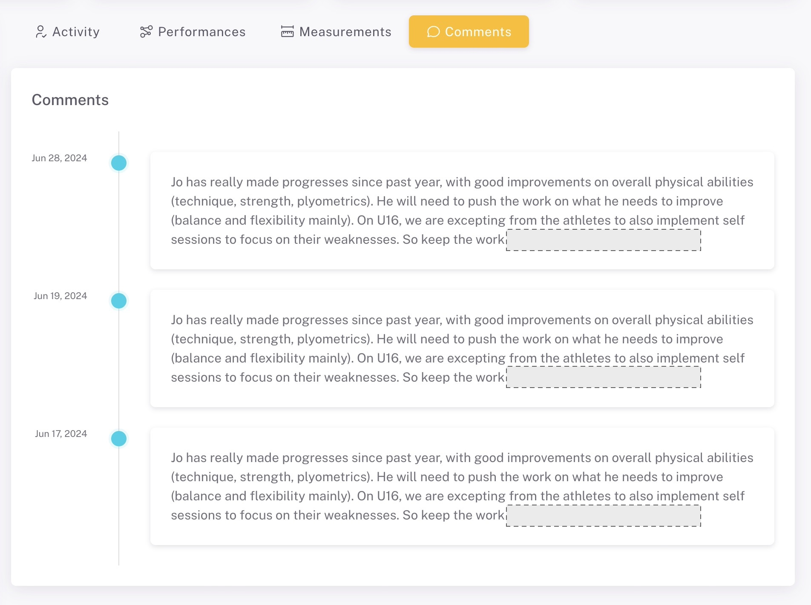

- Coaches can add and view comments for each athlete
- This feature helps in keeping track of important observations and feedback

### 4. Quick Search

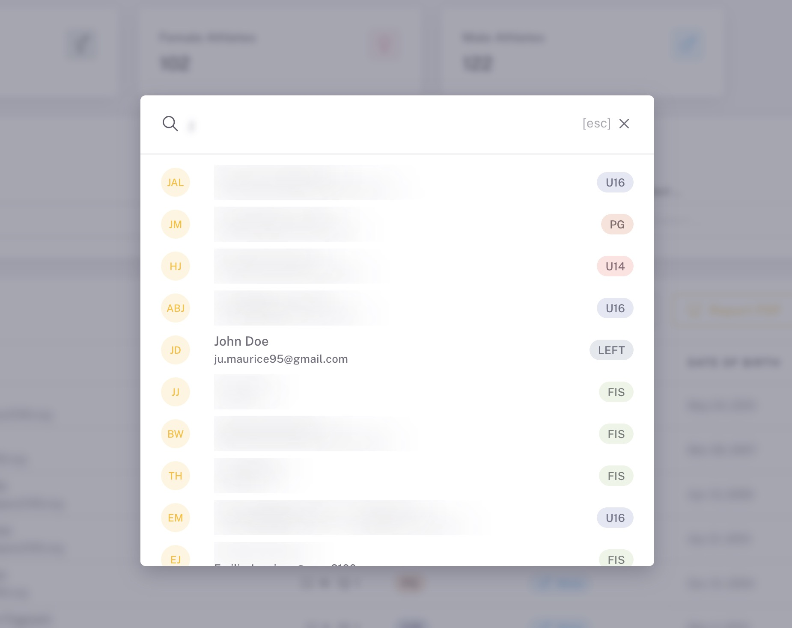

- Rapidly find athletes, groups, or specific data
- Improves workflow efficiency for coaches and administrators

### 5. Athlete List Management

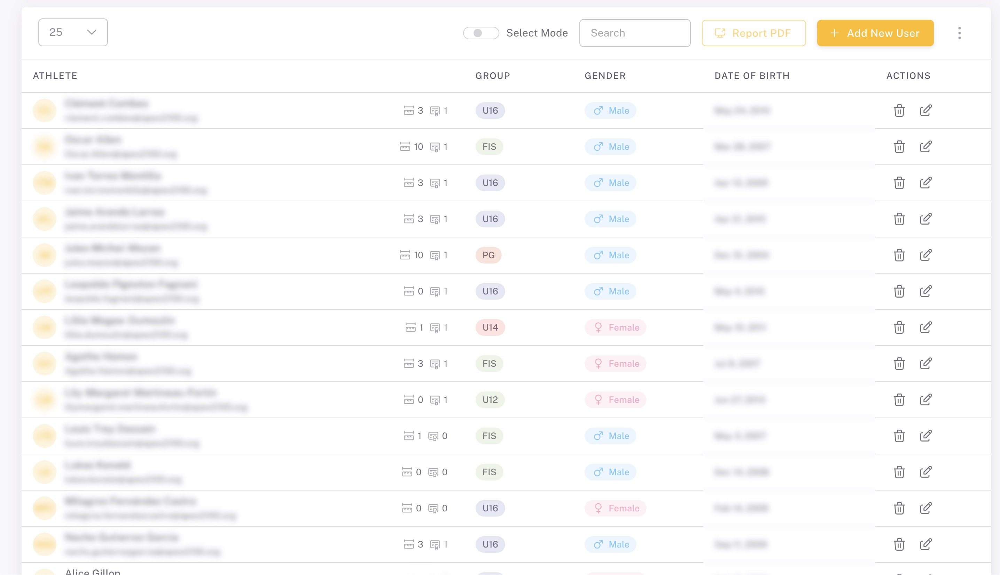

- Provides an overview of all athletes in the system
- Allows for quick navigation to individual athlete profiles
- Useful for general athlete management and organization

### 6. Batch PDF Generation

Coaches can generate PDF reports in batch for multiple athletes or entire groups. This feature streamlines the process of creating and distributing performance reports to athletes and their contacts.

[Watch Batch Report Generation Demo](video/demo_report_batch.mp4)

  
ℹ️ Click for more details

This video illustrates the process of generating multiple PDF reports simultaneously, showcasing how coaches can quickly create and distribute performance summaries. The batch PDF generation feature offers several benefits:

- Time-saving: Coaches can generate reports for entire teams or groups at once
- Consistency: Ensures all reports follow the same format and include the same types of information
- Customization: Options to tailor report content based on specific needs or recipient types
- Efficient distribution: Easy to send reports to multiple athletes and their contacts simultaneously
- Archiving: Automatically stores generated reports for future reference

This feature significantly reduces the administrative workload for coaches, allowing them to focus more on analysis and athlete development.

## Additional Video Demonstrations

### Athlete Page Demo
[📽️ Watch Demo](video/demo_athlete_page.mp4)

  
ℹ️ Click for more details

This video showcases the detailed athlete page, demonstrating how coaches can view and analyze individual athlete data. It covers:

- Navigation through different sections of the athlete profile
- Viewing performance history and trends
- Accessing detailed metrics and scores
- Using interactive features to gain insights into an athlete's progress
- Demonstrating how coaches can use this information to make informed decisions about training and development

### Scoring Criteria Demo
[📽️ Watch Demo](video/scoring_criteria_demo.mp4)

  
ℹ️ Click for more details

This video explains the process of setting up and adjusting scoring criteria, showing how the system can be customized for different groups and performance metrics. It includes:

- Creating new scoring criteria for different exercises
- Adjusting existing criteria based on athlete development or changing standards
- Demonstrating how the system applies these criteria to raw performance data
- Explaining the impact of different scoring methods on athlete evaluation
- Showcasing the flexibility of the system in accommodating various sports and performance metrics

## Conclusion

Key benefits of the SkillSync system include:

1. Athlete data tracking: From individual skills to overall performance, the system provides a picture of each athlete's development.

2. Customizable evaluation criteria: Coaches can tailor scoring and assessment methods to their specific sport and athlete groups.

3. Efficient data management: Bulk import features and interfaces reduce administrative workload, allowing coaches to focus on athlete development.

4. Analysis tools: Interactive graphs, comparisons, and leaderboards provide insights into individual and team performance.

5. Streamlined reporting: Automated report generation and distribution keep all stakeholders informed of athlete progress.

## Technologies Used

SkillSync is built using a modern tech stack to ensure performance, scalability, and maintainability:

1. Frontend
   - Vue.js 3: Progressive JavaScript framework for building user interfaces
   - Vuetify: Material Design component framework for Vue.js
   - Apex Chart: Flexible JavaScript charting library for data visualization

2. Backend
   - Supabase: Open-source Firebase alternative providing a PostgreSQL database, authentication, instant APIs, and realtime subscriptions
   - Node.js: JavaScript runtime built on Chrome's V8 JavaScript engine

3. Data Storage and Management
   - PostgreSQL: Advanced open-source relational database
   - Supabase Storage: Object storage service for files and documents

4. Authentication and Security
   - Supabase Auth: Built-in authentication and authorization system
